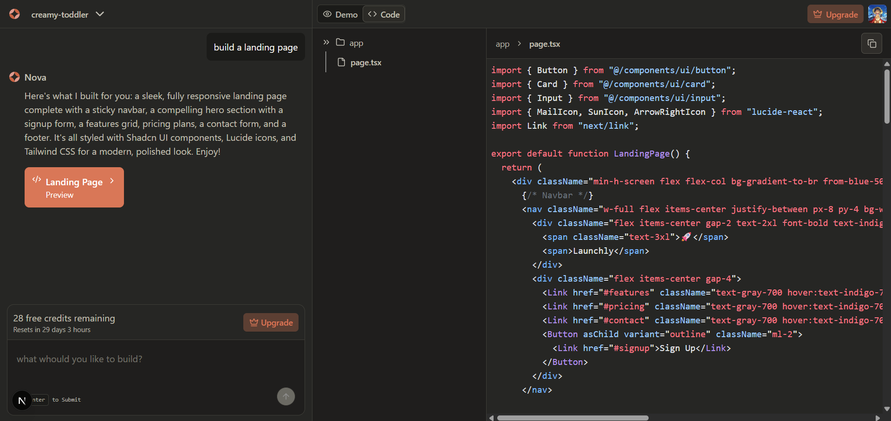

# Nova 🚀

**An AI-powered code generation platform that transforms natural language into fully functional Next.js applications**

<div align="center">
  
  
  [](https://your-demo-url.com)
  [](https://github.com/onkar-03/nova)
</div>

---

Nova empowers developers and non-technical users to build modern web applications through conversational AI. Simply describe what you want to build, and Nova's intelligent agents will generate, execute, and deploy production-ready code in real-time sandboxed environments.

## 🎬 Demo

<div align="center">
  
  <p><em>Watch Nova generate a complete application from natural language</em></p>
</div>

## ✨ Features

<table>
<tr>
<td width="50%">

### 🤖 AI-Powered Code Generation

Advanced multi-agent system using GPT-4 for intelligent code creation


</td>
<td width="50%">

### ⚡ Real-time Development

Live sandboxed environments with hot reload and instant preview



</td>
</tr>
<tr>
<td width="50%">

### 🎨 Modern UI Components

Pre-built Shadcn/UI components with Tailwind CSS styling


</td>
<td width="50%">

### 🔐 Authentication & Security

Secure user management with Clerk authentication


</td>
</tr>
</table>

**Additional Features:**

- **📊 Project Management**: Organize and track multiple projects with persistent storage
- **🛠️ Tool Integration**: Automated dependency management and file system operations
- **📱 Responsive Design**: Mobile-first approach with modern, professional interfaces
- **🚀 Production Ready**: Built with TypeScript, Prisma ORM, and enterprise-grade architecture

## 🛠️ Tech Stack

### Frontend

- **Next.js 15.3.5** - React framework with App Router
- **React 19** - Latest React with concurrent features
- **TypeScript** - Type-safe development
- **Tailwind CSS 4** - Utility-first CSS framework
- **Shadcn/UI** - Modern, accessible component library
- **Lucide React** - Beautiful icon library

### Backend & Database

- **Prisma ORM** - Type-safe database access
- **PostgreSQL** - Robust relational database
- **tRPC** - End-to-end typesafe APIs
- **TanStack Query** - Data fetching and caching

### AI & Automation

- **Inngest Agent Kit** - Multi-agent orchestration
- **OpenAI GPT-4** - Advanced language model
- **E2B Code Interpreter** - Sandboxed code execution
- **Zod** - Schema validation

### Authentication & Security

- **Clerk** - Complete authentication solution
- **Rate Limiting** - API protection and usage control

## 🚀 Getting Started

### Prerequisites

- Node.js 18+ and npm/yarn/pnpm
- PostgreSQL database
- OpenAI API key
- Clerk authentication keys
- E2B API key for code execution

### Installation

1. **Clone the repository**

   ```bash
   git clone https://github.com/onkar-03/nova.git
   cd nova
   ```

2. **Install dependencies**

   ```bash
   npm install
   ```

3. **Environment Setup**

   Create a `.env.local` file in the root directory:

   ```env
   # Database
   DATABASE_URL="postgresql://..."

   # Authentication (Clerk)
   NEXT_PUBLIC_CLERK_PUBLISHABLE_KEY=pk_...
   CLERK_SECRET_KEY=sk_...

   # AI Services
   OPENAI_API_KEY=sk-...
   E2B_API_KEY=...

   # Application
   NEXT_PUBLIC_APP_URL=http://localhost:3000
   ```

4. **Database Setup**

   ```bash
   npx prisma migrate dev
   npx prisma generate
   ```

5. **Start Development Server**

   ```bash
   npm run dev
   ```

   Open [http://localhost:3000](http://localhost:3000) to view the application.

## 📁 Project Structure

```
nova/
├── prisma/                 # Database schema and migrations
├── public/                 # Static assets
├── src/
│   ├── app/               # Next.js App Router pages
│   ├── components/        # Reusable UI components
│   ├── hooks/            # Custom React hooks
│   ├── inngest/          # AI agent functions
│   ├── lib/              # Utility functions
│   ├── modules/          # Feature-based modules
│   └── trpc/             # tRPC configuration
├── sandbox-templates/     # E2B sandbox configurations
└── ...config files
```

## 🎯 Key Features Deep Dive

### Multi-Agent Architecture


Nova uses a sophisticated multi-agent system where specialized AI agents handle different aspects of development:

- **Code Generation Agent**: Creates React components and application logic
- **Terminal Agent**: Manages package installation and system commands
- **File System Agent**: Handles file creation, updates, and organization

<br clear="right"/>

### Sandboxed Execution


Every generated application runs in isolated E2B sandboxes, providing:

- Safe code execution environment
- Real-time preview capabilities
- Automatic dependency management
- Hot reload functionality

### Smart Project Management


- **Project Persistence**: All projects are saved with full code history
- **Message Threading**: Conversational development with context awareness
- **Fragment System**: Modular code generation and updates
- **Usage Tracking**: Monitor AI resource consumption

## 🧪 Development Scripts

```bash
npm run dev         # Start development server with Turbopack
npm run build       # Build for production
npm run start       # Start production server
npm run lint        # Run ESLint
npm run postinstall # Generate Prisma client
```

## 🚀 Deployment

### Vercel (Recommended)

1. Connect your GitHub repository to Vercel
2. Configure environment variables in Vercel dashboard
3. Deploy automatically on every push to main branch

### Docker

```dockerfile
# Production deployment with multi-stage build
FROM node:18-alpine AS deps
# ... (Docker configuration available in project)
```

## 🤝 Contributing

We welcome contributions! Please see our [Contributing Guidelines](CONTRIBUTING.md) for details.

1. Fork the repository
2. Create your feature branch (`git checkout -b feature/amazing-feature`)
3. Commit your changes (`git commit -m 'Add some amazing feature'`)
4. Push to the branch (`git push origin feature/amazing-feature`)
5. Open a Pull Request

## 🙏 Acknowledgments

- [Next.js](https://nextjs.org/) - The React framework for production
- [Shadcn/UI](https://ui.shadcn.com/) - For the beautiful component library
- [Inngest](https://www.inngest.com/) - For reliable workflow orchestration
- [E2B](https://e2b.dev/) - For secure code execution environments
- [Clerk](https://clerk.com/) - For seamless authentication

---

**Built with ❤️ by [Onkar](https://github.com/onkar-03)**
